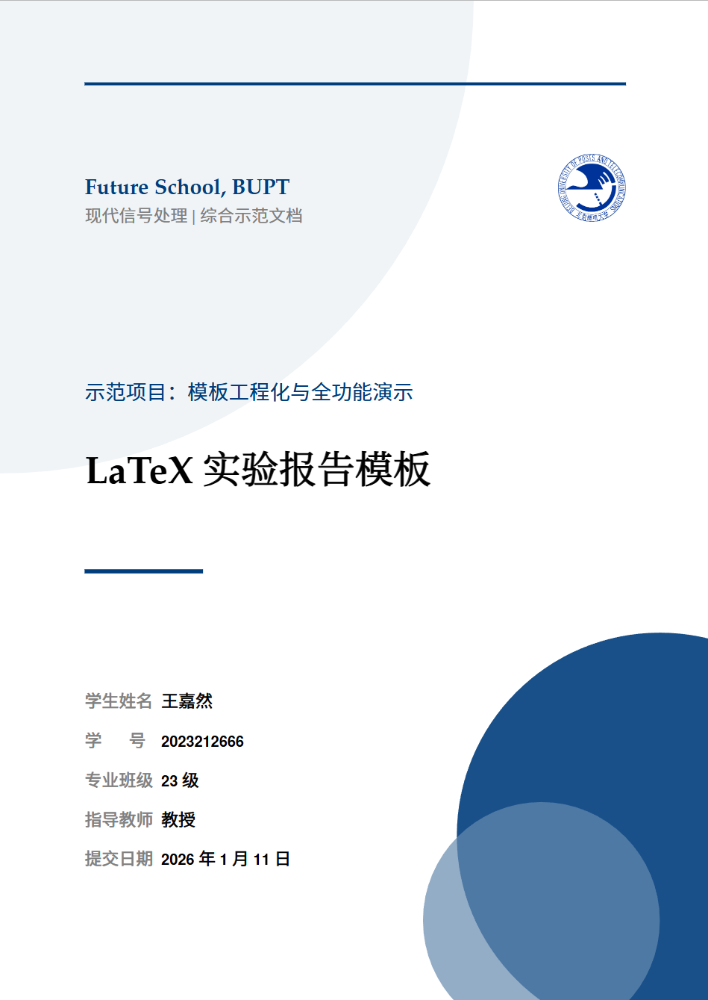

# BUPT 风格 LaTeX 实验报告模板

[](#)
[](#)
[](#)
[](#)
[](#)

面向 BUPT 课程实验与技术报告的工程化 LaTeX 模板。



## 项目亮点
- **一处配置，全局生效**：`tex/meta.tex` 集中管理元信息与功能开关。
- **稳定且有辨识度**：统一的封面、标题、页眉页脚与配色体系。
- **示例完整可复用**：数学、算法、表格、电路、绘图、交叉引用一应俱全。
- **代码展示更高级**：Mac 风格代码窗（`maccode`），支持 `minted`/`listings`。
- **工程化编译**：内置 `latexmkrc`，产物与中间文件分离。

## 快速开始
1. 安装 TeX Live / MiKTeX（要求 XeLaTeX 或 LuaLaTeX）。
2. 编译：
   ```bash
   latexmk
   ```
3. 产物输出：`output/main.pdf`

## 功能开关一览（`tex/meta.tex`）
| 开关 | 作用 | 默认 |
| --- | --- | --- |
| `UseUnicodeMath` | Unicode 数学字体 | true |
| `UseMinted` | 代码高亮（Pygments） | true |
| `UseCircuitikz` | 电路图支持 | true |
| `UsePgfplots` | 科研绘图支持 | true |
| `UseBiblatex` | 文献管理 | true |
| `UseGlossaries` | 术语表/缩略语 | true |
| `UseIndex` | 索引 | true |
| `UseTodo` | 批注/待办 | false |
| `UseWatermark` | 水印 | false |

## 推荐工具链
- 引擎：XeLaTeX / LuaLaTeX
- 文献：biber（启用 `biblatex` 时）
- 术语表：makeglossaries
- 索引：upmendex
- 代码高亮：Python + Pygments（启用 `minted` 时）

## 目录结构
- `main.tex`：主入口，负责结构编排。
- `tex/`：模板核心（元信息、版式、封面、可选模块、结构宏）。
- `sections/`：正文内容示例（摘要、数学、算法、表格、电路、绘图等）。
- `refs.bib`：参考文献库。
- `latexmkrc`：编译配置。
- `output/`：PDF 产物。
- `build/`：中间文件。

## 定制指南
- `tex/meta.tex`：改封面信息、课程名称、作者与功能开关。
- `tex/cover.tex`：调整封面布局与视觉风格。
- `tex/setup.tex`：统一管理字体、颜色、页眉页脚、代码环境。
- `sections/`：替换为你的报告内容。
- `refs.bib`：补充参考文献条目。

## 常见问题
- `minted` 报错：确认安装 Pygments，编译允许 `-shell-escape`。

## 使用建议
- 先改 `tex/meta.tex`，再替换 `sections/` 内容。
- 保持主文件简洁，把样式与逻辑放在 `tex/` 中维护。
